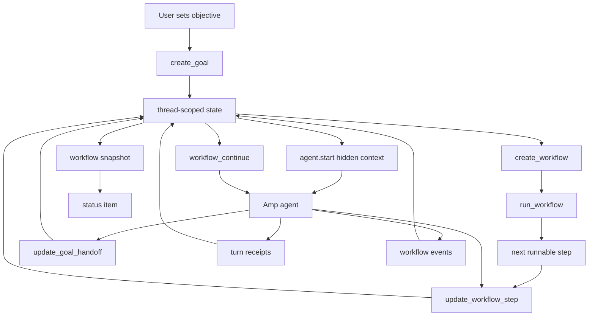

# amp-goal-plugin

Compaction-safe goals and workflow state for [Amp](https://ampcode.com).

Persistent thread objective, dependency-aware phased workflow runner, handoff note, turn receipts, workflow events, and an Amp status item.

State is stored in Amp plugin config, not repo files.

> Inspired by Codex CLI `/goal` and Claude Code workflows. Not affiliated with OpenAI, Anthropic, or Amp.



## What it adds

- Codex-like durable goal: objective stays outside fragile chat context.
- Claude-like workflow discipline: phases, stable step ids, dependencies, per-step verification, handoff notes.
- Amp-native runner: turn-start context injection, config storage, snapshots, event log, status item, and tool-history receipts.
- Evidence-first completion: prompts the agent to prove the full objective before `complete`.

## Why not just copy workflows?

Claude Code workflows are a runtime pattern. This plugin keeps Amp as the runtime and adds the missing durable control plane:

- `create_workflow`: write the phased plan
- `run_workflow`: activate the next dependency-ready step
- `workflow_continue`: return compaction-safe workflow context on request
- `update_workflow_step`: record active/done/blocked state with evidence
- `update_goal_handoff`: leave a compact handoff note

The difference: the plugin stores compact Amp-native state, derives a fresh workflow snapshot each turn, and injects hidden goal/workflow/receipt/handoff-note context when a turn starts.

## Install

If `amp plugins add` rejects this GitHub URL, install the plugin by copying the raw file:

```bash
mkdir -p ~/.config/amp/plugins
curl -fsSL https://github.com/lleewwiiss/amp-goal-plugin/raw/master/src/goal.ts \
  -o ~/.config/amp/plugins/goal.ts
```

Reload Amp plugins:

```text
plugins: reload
```

Uninstall:

```bash
amp plugins remove --target system goal.ts
```

## Use

```text
Set the active goal to finish the auth migration. Keep a workflow and handoff note.
```

Useful commands:

- `goal: open goal menu`
- `goal: activate next goal workflow step`
- `goal: show goal status`
- `goal: show goal workflow`
- `goal: show goal handoff note`
- `goal: pause goal`
- `goal: resume goal`
- `goal: clear goal`

Legacy-compatible tools: `goal_continue` and `update_goal_workflow` still work.

Status bar examples stay compact:

```text
⠋ Goal active · Step 2/5 · 12m
Ⅱ Goal paused · Step 2/5 · 18m
■ Goal blocked · Step 4/5 · 27m
✓ Goal complete · 5/5 done · 31m
⠋ Goal active · 12m
```

Workflow output carries the detail:

```text
Workflow: 1/2 done, current 2/2
Phases: Discovery 1/1 done; Verification 0/1 done, current step 2

Current step:
Phase: Verification
▶ 2. verify: Verify smoke result
   after: inspect

Recent workflow events:
- just now created: workflow set
- just now activated inspect: Inspect smoke state
- just now done inspect: real Amp smoke activated inspect
- just now activated verify: Verify smoke result
```

## Development

```bash
bun install
bun run check
bun run install:plugin
```

MIT. See [LICENSE](LICENSE).
