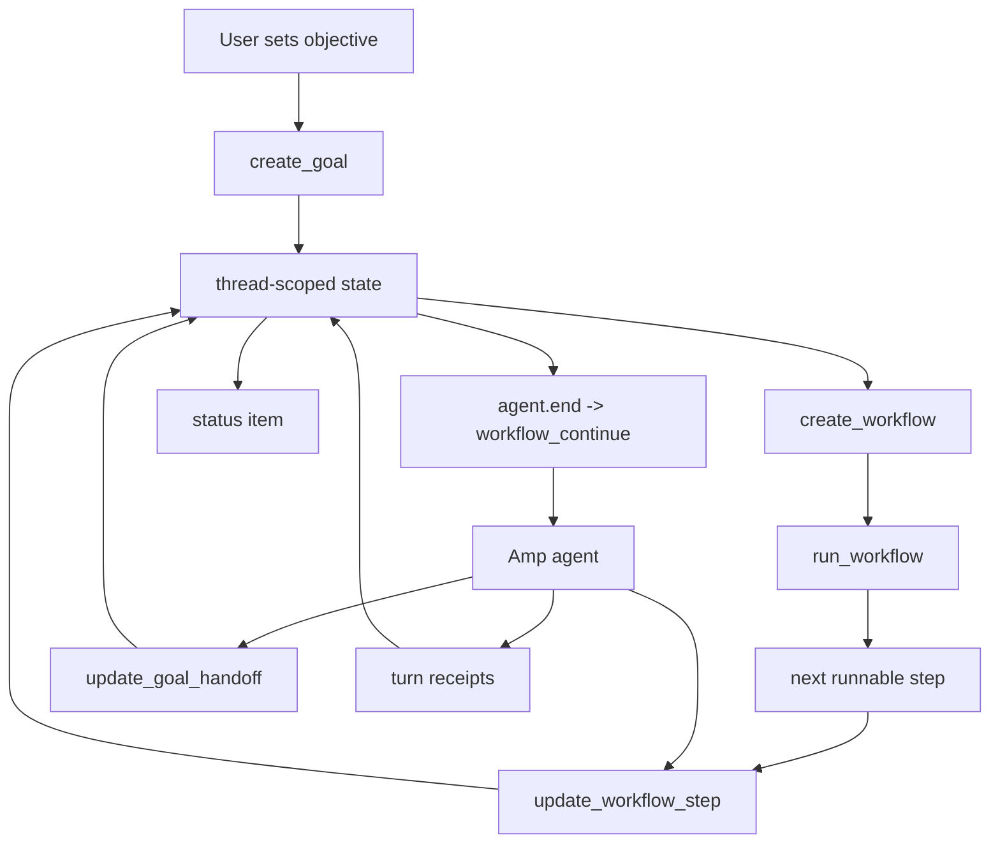

# amp-goal-plugin

Compaction-safe goals and workflow state for [Amp](https://ampcode.com).

Persistent thread objective, dependency-aware workflow runner, handoff capsule, turn receipts, and a status item that stays hidden until a goal exists.

> Inspired by Codex CLI `/goal` and Claude Code workflows. Not affiliated with OpenAI, Anthropic, or Amp.



## What it adds

- Codex-like durable goal: objective stays outside fragile chat context.
- Claude-like workflow discipline: stable step ids, dependencies, per-step verification, handoff.
- Amp-native runner: lifecycle continuation, status item, config storage, and tool-history receipts.
- Evidence-first completion: prompts the agent to prove the full objective before `complete`.

## Why not just copy workflows?

Claude Code workflows are a runtime pattern. This plugin keeps Amp as the runtime and adds the missing durable control plane:

- `create_workflow`: write the phased plan
- `run_workflow`: activate the next dependency-ready step
- `workflow_continue`: resume after compaction or `agent.end`
- `update_workflow_step`: record active/done/blocked state with evidence
- `update_goal_handoff`: leave a compact handoff capsule

## Install

```bash
mkdir -p ~/.config/amp/plugins
curl -fsSL https://raw.githubusercontent.com/lleewwiiss/amp-goal-plugin/master/src/goal.ts \
  -o ~/.config/amp/plugins/goal.ts
```

Reload Amp plugins:

```text
plugins: reload
```

## Use

```text
Set the active goal to finish the auth migration. Keep a workflow and handoff.
```

Useful commands:

- `goal: open goal menu`
- `goal: run goal workflow`
- `goal: show goal status`
- `goal: show goal workflow`
- `goal: show goal handoff`
- `goal: pause goal`
- `goal: resume goal`
- `goal: clear goal`

Legacy-compatible tools: `goal_continue` and `update_goal_workflow` still work.

Status examples:

```text
⠋ Goal active · Step 2/5 · 12m
⠋ Goal active · 12m
```

## Development

```bash
bun install
bun run check
bun run install:plugin
```

MIT. See [LICENSE](LICENSE).
