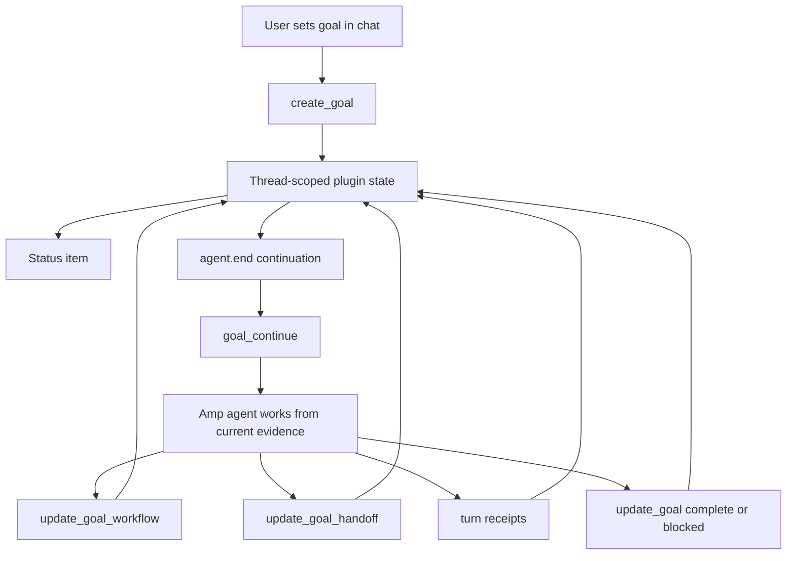

# amp-goal-plugin

Compaction-safe goals and workflow state for [Amp](https://ampcode.com).

The plugin keeps long-running work anchored outside chat history: a thread objective, workflow ledger, handoff capsule, recent turn receipts, and a status item that stays hidden until a goal exists.

> Inspired by Codex CLI `/goal` and Claude Code workflows. Not affiliated with OpenAI, Anthropic, or Amp.

## What it does

- persists goals in thread-scoped plugin config
- continues active goals from `agent.end`
- rehydrates objective, workflow, handoff, and receipts through `goal_continue`
- records bounded receipts from Amp lifecycle events and tool history
- prompts agents to verify completion against current evidence
- hides inactive status instead of showing `Goal: none`



## Design

This borrows Codex CLI's durable `/goal` idea and Claude Code's workflow/handoff discipline: keep the objective stable, expose progress, resume from compact state, and finish only after evidence review.

It is not Claude Code's JavaScript workflow runtime. Amp remains the orchestrator. The plugin uses Amp's own primitives — configuration, lifecycle events, status items, continuation, and tool-history helpers — so workflow state survives compaction, remote sessions, and handoffs without pretending to be a separate runner.

## Install

```bash
mkdir -p ~/.config/amp/plugins
curl -fsSL https://raw.githubusercontent.com/lleewwiiss/amp-goal-plugin/master/src/goal.ts \
  -o ~/.config/amp/plugins/goal.ts
```

Reload Amp plugins:

```text
plugins: reload
```

Expected tools: `create_goal`, `replace_goal`, `get_goal`, `goal_continue`, `update_goal_workflow`, `update_goal_handoff`, `update_goal`.

## Use

Set goals in chat so normal `@file` references still work:

```text
Set the active goal to finish the Stripe webhook retry work. Reference @apps/web/src/server/stripe/webhook.ts.
```

For larger work:

```text
Set the active goal to finish the auth migration, keep a workflow checklist, and keep a concise handoff for the next session.
```

Useful commands:

- `goal: open goal menu`
- `goal: show goal status`
- `goal: show goal workflow`
- `goal: show goal handoff`
- `goal: pause goal`
- `goal: resume goal`
- `goal: clear goal`

## Status

```text
⠋ Goal active · Step 2/5 · 12m
⠋ Goal active · 12m
```

No active goal means no status item.

## Development

```bash
bun install
bun run check
bun run install:plugin
```

## License

MIT. See [LICENSE](LICENSE).
